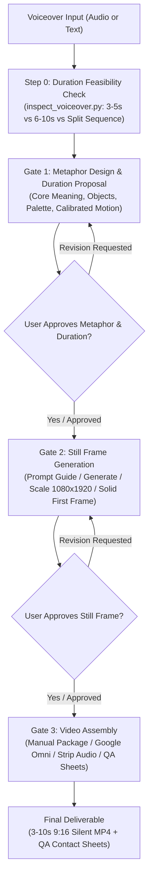

# gbro Collage B-Roll (Halftone Paper-Collage)

Transform a voiceover line (or audio recording) into a sharp visual concept, then assemble it into a premium editorial paper-collage B-roll animation (3 to 10 seconds).

## Key Visual Aesthetic
- **Solid Paper Color Field:** Bold, flat, uncoated-paper background (custom hex per topic).
- **Halftone Photographic Cut-outs:** Black-and-white halftone textures form the main structure.
- **Colored Cardstock Accents:** Vibrant paper accents (yellow, red, teal, orange, violet) highlight key focal elements.
- **Physical Paper Craft:** Crisp machine-cut edges, thin warm-cream keylines, soft low-opacity physical drop shadows, fine paper grain.
- **Assemble-from-Empty Motion:** Elements slide in, snap into place, and lock together with tactile stop-motion timing from an empty color canvas to a completed poster composition (no slow zoom, no camera drift, no 3D morphing).
- **Standard Deliverable:** 9:16 vertical, 3 to 10 seconds (default 5s, configurable up to 10s), 720×1280 or 1080×1920, 24 fps, completely silent MP4.

---

## Voiceover Input & Duration Planning

You can start the workflow using either a **text sentence** or an **audio file**:

### Option A: Text Script (Default & Simplest)
You do **not** need an audio file. Simply provide the sentence or quote from your script:
```text
collage b-roll: Most people think AI will do the thinking for them, but it's really just a mirror reflecting your prompt's flaws.
```
- A typical spoken sentence of 12–18 words takes about **5 seconds** to speak aloud.
- A longer sentence of 20–30 words takes about **8 to 10 seconds**.
- **Mandatory Step:** ALWAYS inspect script duration using `inspect_voiceover.py` before proposing Gate 1:
```bash
python scripts/inspect_voiceover.py "Your voiceover sentence here"
```

### Option B: Audio File (.mp3, .wav, .m4a)
If you already recorded your voiceover, point to the audio file:
```bash
python scripts/inspect_voiceover.py path/to/voiceover.mp3
```
The script uses `ffprobe` to measure the exact spoken duration and automatically suggests the ideal video length (e.g., 7.5s audio -> 8s video).

### Pacing Rules: 5 Seconds vs. 8–10 Seconds vs. Split Sequence
- **Never force a 20+ word sentence into 5 seconds:** That requires speaking at >250 WPM (rushed/unnatural).
- **5 Seconds (Punchy B-Roll):** Best for 10–16 words. Pacing: 0–3.5s fast assembly, 3.5–5s hold finished composition.
- **8–10 Seconds (Editorial & Complex Metaphors):** Best for 18–30 words. Pacing: 0–6.5s layered multi-phase assembly, 6.5–10s steady poster hold.
- **Split Sequence (Two 5s Clips):** When a 20+ word sentence has a rhetorical turn (e.g. "People think X, [CUT] but actually Y"), offering a 2-clip cut gives maximum viewer retention on TikTok/Shorts/Reels.

---

## Operating Modes: Manual / Hybrid vs. API

This workflow supports two operational modes:

| Feature | Manual / Hybrid Mode (Default / Zero API Keys) | Automated API Mode |
|---|---|---|
| **API Key Requirement** | **None** (Zero API keys needed) | Requires `GEMINI_API_KEY` |
| **Duration Support** | **3 to 10 seconds** (user selectable in Google Omni/Flow) | 3 to 10 seconds (via `--duration`) |
| **Image Generation (Gate 2)** | **Primary:** Agent directly generates the 9:16 still frame via built-in tool.<br/>**Fallback:** If tool is unavailable, exhausted, or rate-limited, agent exports `manual-image-prompt.md`. User generates via **Nano Banana** (or external AI) and saves to `frames/last-frame-original.png`. Script scales and generates `first-frame.png`. | Automated via built-in agent image tool. |
| **Video Generation (Gate 3)** | Agent exports complete prompt & specs (`manual-video-prompt.md`, `omni-prompt.txt`). User generates in Google Omni / Google Flow / Veo web UI with `first-frame.png` & `last-frame.png`, saves to `omni/run-v01/final-{duration}s.mp4`. Script handles audio stripping & QA. | Automated via `scripts/generate_video.py` calling `gemini-omni-flash-preview`. |
| **Dependencies** | Python >= 3.10, ffmpeg, ffprobe | Python >= 3.10, ffmpeg, ffprobe, `google-genai >= 2.10.0` |

---

## Environment Self-Check

Before starting Gate 1, verify the local environment:

```bash
# Cross-platform Python check (Default: Manual Mode)
python scripts/check_setup.py

# Or for API mode verification:
python scripts/check_setup.py --mode api
```

In Manual Mode, only `ffmpeg`, `ffprobe`, and `python >= 3.10` are required.

---

## The Three Mandatory Approval Gates



### Gate 1: Visual Metaphor & Duration Proposal
**Deliverable:** Conceptual design and calibrated timing plan only. No images, no video generation.

When given a script line, FIRST inspect duration using `scripts/inspect_voiceover.py`. Never assume 5 seconds. Output:
1. **Duration & Pacing Plan:** Word count, estimated speaking duration (~140 WPM), recommended clip duration (3s–10s). If >18 words, explicitly offer:
   - (A) Extended duration (e.g. 8–10s) with multi-phase assembly timing breakdown, or
   - (B) Split into a 2-clip sequence (each 5s) for fast-paced short-form retention, or
   - (C) Tighten copy to fit a single 5s clip.
2. **Core Meaning:** What the audience should instantly grasp.
3. **Mood / Tone:** e.g., Analytical, Urgent, Revelatory, Playful, Satirical.
4. **One-Sentence Visual Proposition:** The single visual metaphor.
5. **3–6 Key Objects:** Halftone photo cutouts + colored cardstock components.
6. **Color Palette:** Flat background hex code + accent paper colors.
7. **Calibrated Assembly Motion Sequence:** Piece-by-piece entry order with exact second-by-second timestamps tailored to the chosen duration (e.g., 5s: 0-3.5s assembly, 1.5s hold; 10s: 0-6.5s layered assembly, 3.5s hold).

**Action:** **HALT and wait for user confirmation** ("Approved", "Go ahead", or specific revision requests). In batch requests, only advance approved items.

---

### Gate 2: Still-Frame Preparation & Approval
**Deliverable:** Vertical 9:16 completed collage still frame (`last-frame.png`), solid color opening frame (`first-frame.png`), and `still-contact-sheet.jpg`.

#### Workflow Execution:

##### Path A: Agent Direct Generation (Primary / Default Time Saver)
1. **Write Visual Specification:** Save `<project>/<item>/visual-spec.json`.
2. **Generate Still Frame:** Agent directly invokes the built-in `generate_image` tool (AspectRatio: `9:16`) using the optimized paper-collage prompt.
3. **Save Raw Image:** Save the generated image to `<project>/<item>/frames/last-frame-original.png`.
4. **Format & Prepare Frames:**
   Run:
   ```bash
   python scripts/process_frames.py --item "<project>/<item>" --color "<HEX>"
   ```
   This automatically:
   - Resizes/crops `last-frame-original.png` into 1080×1920 `last-frame.png`.
   - Generates the matching solid background `first-frame.png`.
   - Builds `still-contact-sheet.jpg` and writes `<project>/gate2-qa.md`.
5. **Present to User:** Show the still frame and contact sheet to the user.

##### Path B: Fallback / Manual Generation (via Nano Banana)
*Trigger if: `generate_image` tool is unavailable, rate-limited, quota-exhausted, or if the user requests manual control.*
1. **Write Visual Specification:** Save `<project>/<item>/visual-spec.json`.
2. **Export Manual Prompt Guide:**
   Run:
   ```bash
   python scripts/process_frames.py --item "<project>/<item>" --color "<HEX>" --prompt "<IMAGE_PROMPT>" --export-guide-only
   ```
   This creates `<project>/<item>/manual-image-prompt.md`.
3. **Notify User:**
   Provide the user with:
   - The exact prompt and link to `manual-image-prompt.md`.
   - Settings: 9:16 vertical aspect ratio.
   - Target destination: `<project>/<item>/frames/last-frame-original.png`.
4. **User Generates Image:**
   User generates the image in **Nano Banana** (or Midjourney / external generator), and saves the image to `frames/last-frame-original.png`.
5. **Ingest & Prepare Frames:**
   Once user notifies the agent that the image is saved:
   ```bash
   python scripts/process_frames.py --item "<project>/<item>" --color "<HEX>"
   ```

**Action:** **HALT and wait for user confirmation** on the still frame before proceeding to Gate 3.

---

### Gate 3: Video Assembly & Quality Assurance
**Deliverable:** 3 to 10-second 9:16 silent assembly MP4 (`final-{duration}s-noaudio.mp4`), adaptive contact sheet, opening frame check, and end-frame comparison.

#### Manual Mode (Default / No-API):
1. **Prepare Manual Video Package:**
   Run:
   ```bash
   python scripts/prepare_manual_video.py --item "<project>/<item>" --prompt "<OMNI_ANIMATION_PROMPT>" --color "<HEX>"
   ```
   This creates:
   - `<item>/manual-video-prompt.md`: Comprehensive step-by-step instructions.
   - `<item>/omni-prompt.txt`: Raw prompt for copying.
   - Verified paths for `first-frame.png` (Image 1) and `last-frame.png` (Image 2).
2. **Notify User:**
   Alert the user with clickable links:
   - **Guide:** [`manual-video-prompt.md`](file:///path/to/manual-video-prompt.md)
   - **Image 1 (Start Frame):** [`first-frame.png`](file:///path/to/first-frame.png)
   - **Image 2 (End Frame):** [`last-frame.png`](file:///path/to/last-frame.png)
   - **Target Output File:** `<item>/omni/run-v01/final-5s.mp4`
   - **Instructions:** Open Google Omni Video Generator / Google Flow, select Start & End frame mode, upload the two images, paste the prompt, generate 5s 9:16 video, and save as `final-5s.mp4`.
3. **User Saves Video & Resumes Workflow:**
   Once user places `final-5s.mp4` and confirms:
   ```bash
   python scripts/process_video.py --item "<project>/<item>"
   ```
   The script automatically:
   - Strips audio track using ffmpeg -> `final-5s-noaudio.mp4`.
   - Generates 5-frame contact sheet -> `contact-sheet.jpg`.
   - Extracts opening frame -> `video-first-frame.jpg` (verifies clean start).
   - Extracts closing frame -> `video-last-frame.jpg`.
   - Generates side-by-side comparison with `last-frame.png` -> `end-frame-comparison.jpg`.
   - Inspects metadata (resolution, duration, fps).
   - Writes `<project>/gate3-qa.md`.

#### Automated API Mode (Optional):
If `GEMINI_API_KEY` is configured and user requests automated generation:
```bash
python scripts/generate_video.py --batch "<project>/omni-jobs.json" --concurrency 3
python scripts/process_video.py --project "<project>"
```

---

## Standard Project Directory Layout

```text
<project-root>/
├── brief.md                         # Original script & briefing notes
├── visual-spec.json                 # Scene definitions & palette
├── imagegen-prompts.md              # Image prompts reference
├── omni-jobs.json                   # Video job definitions
├── gate2-qa.md                      # Gate 2 still-frame verification report
├── gate3-qa.md                      # Gate 3 video verification report
├── still-contact-sheet.jpg          # Combined still frames overview
├── 01-concept-name/
│   ├── manual-image-prompt.md       # Gate 2 manual image generation guide
│   ├── manual-video-prompt.md       # Gate 3 manual video generation guide
│   ├── omni-prompt.txt              # Gate 3 raw prompt text
│   ├── frames/
│   │   ├── last-frame-original.png  # Raw image from image generator
│   │   ├── last-frame.png           # Formatted 1080x1920 end frame
│   │   └── first-frame.png          # Solid color field opening frame
│   └── omni/run-v01/
│       ├── final-5s.mp4             # Generated video (from user or API)
│       ├── final-5s-noaudio.mp4     # Master deliverable (audio stripped)
│       ├── contact-sheet.jpg        # 5-frame progression sheet
│       ├── video-first-frame.jpg    # Verified opening frame
│       ├── video-last-frame.jpg     # Video ending frame
│       └── end-frame-comparison.jpg # Side-by-side comparison with still
└── 02-concept-name/...
```

---

## Semantic Color Palette Reference

Choose background paper fields based on the message semantic:

| Color | Hex Suggestion | Psychological / Semantic Association |
|---|---|---|
| **Deep Navy / Cobalt** | `#1B2A4A`, `#162238` | Systems, logic, structure, engineering |
| **Mustard Yellow** | `#E5A93C`, `#D49728` | Warning, tools, friction, lost efficiency |
| **Burnt Orange / Red** | `#D9531E`, `#B83A24` | Labor, human effort, urgency, raw energy |
| **Forest / Sage Green** | `#264639`, `#2F5242` | Growth, cognition, clarity, reset |
| **Deep Violet** | `#3B284C`, `#452C59` | Long-term memory, standards, governance |
| **Teal / Cyan** | `#1C535E`, `#1A4B54` | Precision, collaboration, automated execution |

---

## Prompt Engineering Templates

### 1. Image Generation Prompt (Gate 2 - Last Frame)
```text
Use case: ads-marketing
Asset type: final still frame for a 9:16 image-to-video B-roll clip
Primary request: Create a finished editorial paper-collage image expressing [ONE-SENTENCE VISUAL THESIS].
Scene/backdrop: perfectly flat [COLOR] paper field [HEX] with subtle uncoated paper fiber.
Style/medium: premium editorial stop-motion paper collage; black-and-white halftone photographic cut-outs mixed with selective [ACCENT COLORS] colored cardstock.
Composition/framing: vertical 9:16 locked poster frame; central subject within middle 70%; generous clean color-field negative space; 3-6 large separable paper groups for assemble-from-empty animation.
Materials/textures: visible printed halftone dots, crisp machine-cut edges, thin warm-cream paper keylines, soft low-opacity physical drop shadows.
Constraints: [CORE RELATIONSHIP VISUALIZED].
Avoid: typography, readable letters, numerals, logos, watermark, UI, subtitles, glossy 3D, photoreal environment, clutter.
```

### 2. Video Animation Prompt (Gate 3 - Google Omni / Flow)
```text
Paper-collage stop-motion assembly, using Image 1 as the exact empty first frame and Image 2 as the exact completed last frame. In one continuous locked-off vertical shot, open on the empty flat [COLOR] paper field.

Assemble the scene piece by piece with crisp physical stop-motion timing: [SEQUENTIAL STEP-BY-STEP DESCRIPTION OF 3-6 PIECES SLIDING IN, SNAPPING INTO PLACE, AND LOCKING TOGETHER]. End by holding the supplied completed composition.

Preserve the exact 9:16 framing, [HEX] color field, colored cardstock accents, uncoated paper grain, halftone dots, cream keylines, crisp cut edges and soft shadows. Restrained tactile 2D paper craft only.

No scene cuts, no camera movement, no zoom, no morphing, no new objects, no text, no letters, no numbers, no logos, no watermark, no UI, no sound.
```

---

## Quality Assurance (QA) Checklist

### Gate 2 Still Frame Criteria
- [ ] Visual metaphor is immediately readable in under 2 seconds.
- [ ] Subject is centrally composed within the vertical 9:16 canvas.
- [ ] Zero readable text, fake words, logos, or UI elements.
- [ ] Uncoated flat paper color field provides clean negative space.
- [ ] 3–6 distinct paper groups rather than noisy confetti.

### Gate 3 Video Assembly Criteria
- [ ] Opening frame starts on pure or near-pure solid color field.
- [ ] Progression shows genuine piece-by-piece tactile stop-motion entry.
- [ ] Final frame matches approved Gate 2 still frame composition.
- [ ] Zero camera motion (no slow zoom, no panning, no 3D distortion).
- [ ] Audio stream is confirmed 0 (completely silent MP4).
- [ ] Matches planned target duration (3 to 10 seconds, verified by ffprobe) at 24 fps.

